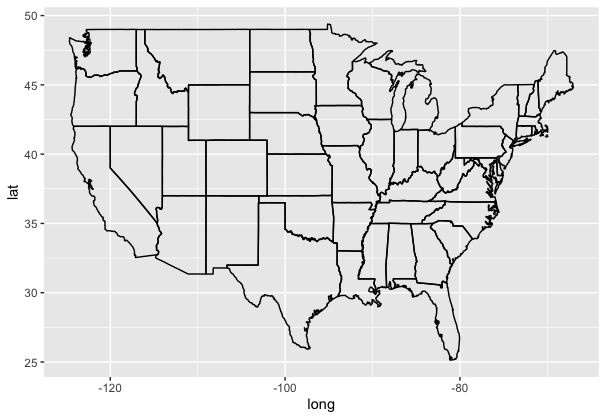
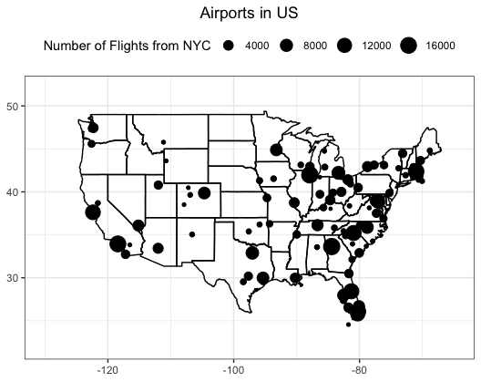
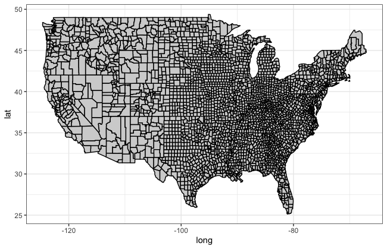
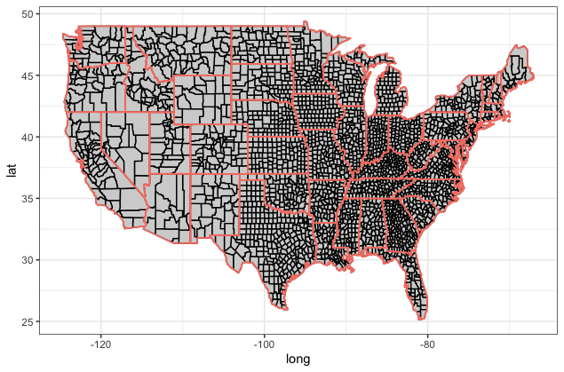
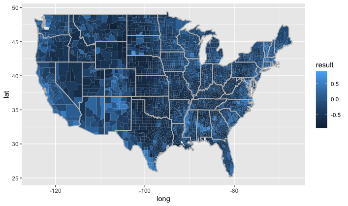
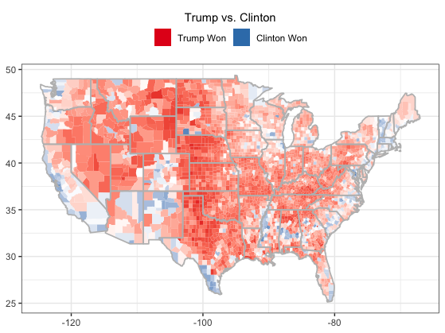

```{r setup, include=FALSE}
knitr::opts_chunk$set(echo = TRUE, tidy = TRUE, 
                      message = FALSE, comment = NA) # Provide some global options for code chunks

# Load the tidyverse
library(tidyverse)

# Install the map package
if (!require(maps)) install.packages("maps")

options(width = 120)      # Increase the width of the printing region to show all columns
```


### 1. Airports and flights

**(a)** The `flights.csv` dataset stores all the flights that departed from New Yord City (i.e. airports JFK, LGA or EWR) in 2013. `dest` is the code of the destination airport, `arr_delay` is the arrival delay (in minutes).

```{r}
flights1 <- read_csv("flights.csv", col_names = TRUE, col_types = cols())
flights2 <- read_csv("flights.csv", col_names = TRUE, col_types = cols())
flights <- bind_rows(flights1, flights2)
```

Calculate the number of flights from NYC (`flight_num`) and the average value of arrival delay (`aver_arr_delay`) for each destination (`dest`) and name the resulting data frame `flight.per.dest`. The expected result is as follows:

```
# A tibble: 105 x 3
   dest  flight_num aver_arr_delay
   <chr>      <int>          <dbl>
 1 ABQ          254           4.38
 2 ACK          265           4.85
 3 ALB          439          14.4 
 4 ANC            8          -2.5 
 5 ATL        17215          11.3 
 6 AUS         2439           6.02
 7 AVL          275           8.00
 8 BDL          443           7.05
 9 BGR          375           8.03
10 BHM          297          16.9 
# … with 95 more rows
```

```{r}
# Edit me
flight.per.dest <- flights %>%
  # group the flights based on its dest
  group_by(dest) %>%
  # find the flight_num and aver_arr_delay for each group
  summarise(flight_num = n(), aver_arr_delay = signif(mean(arr_delay, na.rm = T),3))
flight.per.dest

```

**(b)** The `airports.csv` dataset contains the coordinates (`lon`, `lat`) of 1,458 airports. `faa` stands for FAA airport code.

```{r}
airports <- read_csv("airports.csv", col_names = TRUE, col_types = cols())
```

Add the coordinates (`lon`, `lat`)  of the airports to `flight.per.dest` by joining the tibble `flight.per.dest` and `airports`.

Tips: Use `left_join()` in `dplyr`.   

```{r}
# Edit me
flight.per.dest <- airports %>% select(c(faa,lon,lat)) %>%
  left_join(flight.per.dest, ., by = c("dest"="faa"))
flight.per.dest
```

**(c)** The `state` dataset from the `maps` package contains the longitude and latitude coordinates for the boundaries of the states in the United States mainland.  

```{r}
state <- as_tibble(map_data("state"))
```

Use `state` to create the following map of the US. Tips: `ggplot() + geom_path()`. 

{width=500px}

```{r}
# Edit me
ggplot(state, aes(long, lat)) + geom_path(aes(group=group))


```

**(d)** Use the `flight.per.dest` to add scatter points to the map of the US. Each scatter point represents an airport and the size of the point depends on the number of flights from NYC to the airport. The expected output is as follows. 

Tips: 

1. Set the `data` parameter in individual layers to use a different data set for plotting.

2. Set the axis scale limits to plot for the US mainland only (`lims()`).

3. Suppress the `x` and `y` axis labels (`labs()`). 

4. Move the legend from right to top, move the plot title from left to middle (`theme()`). 

5. `+ theme_bw()`

{width=500px}

```{r}
# Edit me
ggplot(state, aes(long, lat)) + geom_path(aes(group=group)) +
  geom_point(data = flight.per.dest, mapping = aes(x = lon, y = lat, size = flight_num)) + #1
  lims(x=c(-131, -65), y=c(23, 51)) + #2
  labs(x = NULL, y = NULL, title = "Airports in US", size = "Number of Flights from NYC") + #3
  theme_bw() + #5
  theme(plot.title = element_text(hjust = 0.5), legend.position = "top") #4
  
```


### 2. Choreph map for the US 2016 presidential election

**(a)** The `county` dataset from the `maps` package contains the geospatial data for the counties of the United States mainland (without Alaska and Hawaii). 

```{r}
county <- as_tibble(map_data("county"))
county
```

The first two columns contains longitudes and latitudes of county borders. 

Because a county can be made up of seperate regions, each being represented by a geometry, the data frame has the `group` variable used to group the coordinates of the border for every geometry. 

Use `county` to create the county-level map as follows, save it as `county_map`. 

Tips: `ggplot() + geom_polygon()`; set `colour = "black", fill = "lightgray"` for `geom_polygon()`.   

{width=500px}

```{r}
# Edit me
ggplot(county, aes(long, lat, group = group)) +
  geom_polygon(colour = "black", fill = "lightgray") +
  theme_bw()

```


**(b)** Using the state-level geospatial data `state` from package `maps`, place a new layer on the county-level map `county_map` created in (a) to delineate the borders of each state. 

```{r}
state <- as_tibble(map_data("state"))
```

The expected output is as follows.

{width=500px}

Tips: Add another `geom_polygon`; use `colour = "salmon", fill =  NA, size = 0.6` for the aesthetics applied to the state border layer.

```{r}
# Edit me
ggplot(county, aes(long, lat, group = group)) +
  geom_polygon(colour = "black", fill = "lightgray") +
  geom_polygon(data=state, colour = "salmon", fill =  NA, size = 0.6) +
  theme_bw()

```

**(c)** The **USPresidential08-16.csv** file contains the county-level results for the 2008-2016 US presidential elections. 

```{r}
election_08_16 <- read_csv("USPresidential08-16.csv")
election_08_16
```

Select columns that corresponds to the 2016 eletion and calculate a variable that represents the difference in percentage of votes received by two parties (dem vs. gop). Name the new column `result`. Name the resulting tible `election_result`.

The expected output is as follows:

```
# A tibble: 3,112 x 7
    fips county             total_2016 dem_2016 gop_2016 oth_2016  result
   <int> <chr>                   <dbl>    <dbl>    <dbl>    <dbl>   <dbl>
 1 26041 Delta County            18467     6431    11112      924 -0.253 
 2 48295 Lipscomb County          1322      135     1159       28 -0.775 
 3  1127 Walker County           29243     4486    24208      549 -0.674 
 4 48389 Reeves County            3184     1659     1417      108  0.0760
 5 56017 Hot Springs County       2535      400     1939      196 -0.607 
 6 20043 Doniphan County          3366      584     2601      181 -0.599 
 7 37183 Wake County            510940   298353   193607    18980  0.205 
 8 37147 Pitt County             78264    40967    35191     2106  0.0738
 9 48497 Wise County             24661     3412    20655      594 -0.699 
10 21207 Russell County           8171     1093     6863      215 -0.706 
# . with 3,102 more rows
```
 
```{r }
# Edit me
election_result <- election_08_16 %>%
  # select the appropriate columns and change fips_code<chr> into fips<int>
  transmute(fips = as.integer(fips_code), county, total_2016, dem_2016, gop_2016, oth_2016) %>%
  # add the result column
  mutate(result = signif((dem_2016-gop_2016)/total_2016,3))
election_result

```
 
**(d)** The `election_result` tibble has a column named `fips`, which is the FIPS (short for Federal Information Processing Standards) county code that identifies a county. We will use this column to relate the election data to the geospatial data. 

However, the `county` tibble does not have such a column. The `maps` package provides a database named `county.fips` that helps match FIPS codes to county and state names.

```{r}
county_fips <- as_tibble(county.fips)
county_fips
```

Run the following code to augment the `county` tibble with the `fips` column:
 
```{r}
county_aug <- county %>% unite(polyname, region, subregion, sep = ",") %>% inner_join(county_fips, by = "polyname")
county_aug
```

Now, we can join the geospatial data in `county_aug` and the election data in `election_result` by referring to their common variable `fips`. 

```{r }
election_geo_result <- election_result %>% right_join(county_aug, by = "fips") %>% select(-ends_with("2016"))
election_geo_result
```

Here we use `right_join()`, because the election data can be missing for some counties. Also note that this transformation will exclude the election data for Alaska and Hawaii, because `county` only has the geospatial data for the counties of the United States mainland.

Now, use `goem_polygon()` to plot the choreph map with the filling color representing the county-level results (i.e., values in the `result` columns). Outline the borders of all states. Use the following aesthetic settings `colour = "#bdbdbd", fill = NA, size = 0.6` for the state border layer. Use the defaults for all scales. Save the map as `election_map`. 

The expected output is as follows:

{width=500px}
 
```{r}
# Edit me
ggplot(election_geo_result, aes(long, lat, group=group, fill = result)) +
  geom_polygon() +
  geom_polygon(data=state, colour = "#bdbdbd", fill = NA, size = 0.6)

```

**(e)** Decorate `election_map`. Specific requirements and tips are as follows:

1. Use `scale_fill_gradient2()` to customize the color scale to let red (`"#e41a1c"`) represent republican-winning counties and blue (`#377eb8`) represent democrat-winning counties (`high` and `low` in `scale_fill_gradient2()`).  

2. Relabel the legend title to "Trump vs. Clinton" (`name` in `scale_fill_gradient2()`).

3. Show the legend's tick marks only at -1 and 1. Label them with "Trump Won" and "Clinton Won", respectively (`breaks`, `labels`, and `limits` in `scale_fill_gradient2()`).

4. Suppress the axis labels for both axes (`labs()`). 

5. Move the legend from left to top (`legend.position` in `theme()`).

6. `+ theme_bw()`

6. `+ guides(fill = guide_legend(title.position = "top", title.hjust = 0.5))`

The expected output is as follows:

{width=500px}

```{r}
# Edit me
ggplot(election_geo_result, aes(long, lat, group=group, fill=result)) +
  # draw the election_geo_result
  geom_polygon() +
  # draw the state border
  geom_polygon(data=state, colour = "#bdbdbd", fill = NA, size = 0.6) +
  
  scale_fill_gradient2(low = "#e41a1c", high = "#377eb8", #1
                       name = "Trump vs. Clinton", #2
                       breaks=c(-1,1), labels=c("Trump Won", "Clinton Won"), limits=c(-1,1)) + #3
  labs(x=NULL, y=NULL) + #4
  theme_bw() + #6
  theme(legend.position = "top") + #5
  guides(fill = guide_legend(title.position = "top", title.hjust = 0.5)) #6

 
```


